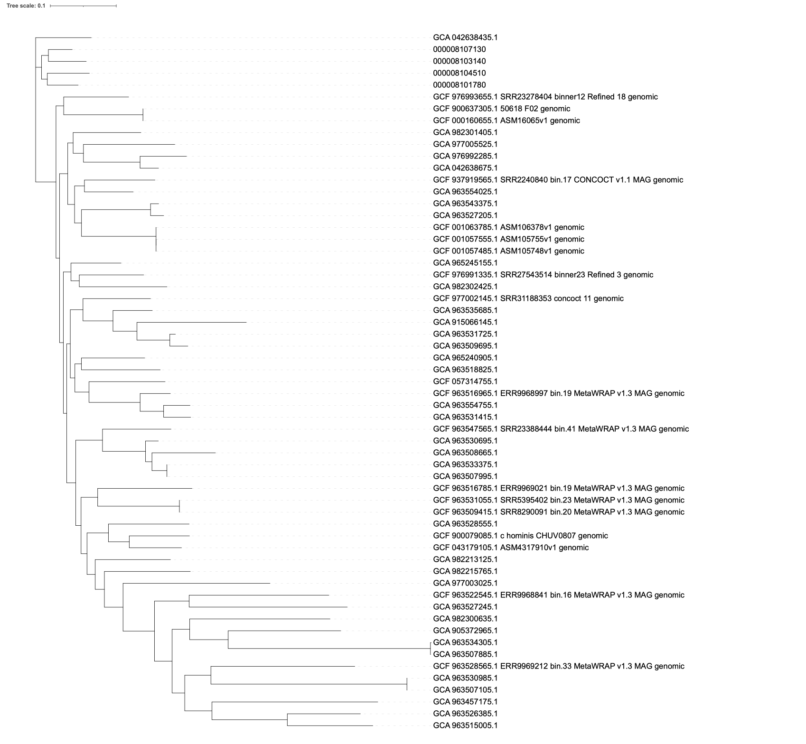

```{bash}
#| eval: false
mkdir -p ../data/C_H/iq_tree_no_outgroup

iqtree -s ../data/C_H/all_core_alignment_no_outgroup_no_BTC_C_H/core_with_ancient/clipkit_core_snps.fa  -m GTR+F+ASC+G4 \
  -bb 1000 -alrt 1000 \
  -nt 3 \
-pre  ../data/C_H/iq_tree_no_outgroup/C_H_ML_tree -redo
```

